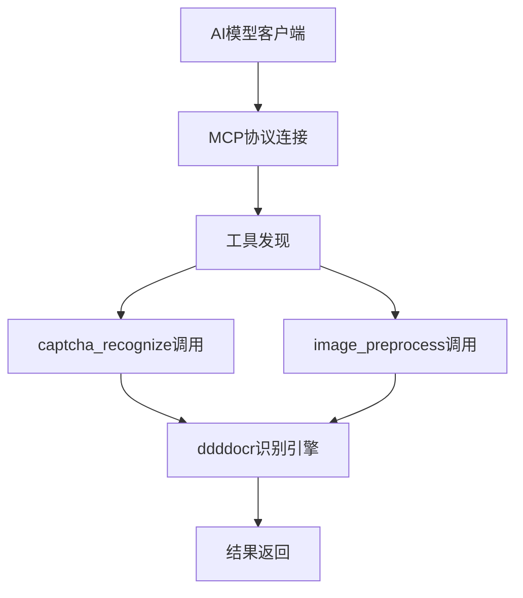

# OCR MCP (Model Context Protocol) 系统产品需求文档

## 1. 产品概述

基于Python的轻量级OCR MCP系统是一个符合Model Context Protocol标准的免费OCR服务器，专门为AI模型提供简洁高效的验证码识别服务。
- 系统实现MCP协议规范，通过JSON-RPC 2.0与AI模型进行直接通信
- 采用ddddocr库作为核心识别引擎，为AI模型提供高精度的验证码识别能力
- 轻量级设计，无需数据库存储，无需用户注册，开箱即用
- 完全免费使用，专注于核心OCR功能，性能优异

## 2. 核心功能

### 2.1 用户角色

| 角色 | 连接方式 | 核心权限 |
|------|----------|----------|
| AI模型客户端 | MCP协议连接 | 可调用OCR工具，获取验证码识别和图像处理服务 |
| 开发者 | MCP客户端SDK | 可集成MCP客户端，开发AI应用程序 |

### 2.2 MCP工具模块

我们的轻量级OCR MCP系统提供以下核心工具：
1. **captcha_recognize工具**：基于ddddocr的验证码识别工具，支持多种验证码类型
2. **image_preprocess工具**：图像预处理工具，包括去噪、增强、标准化等功能

### 2.3 MCP工具详情

| 工具名称 | 工具类型 | 功能描述 |
|----------|----------|----------|
| captcha_recognize | function | 接收图像数据，返回验证码识别结果和置信度，支持多种验证码格式 |
| image_preprocess | function | 对输入图像进行预处理优化，包括去噪、对比度增强、尺寸调整等 |

## 3. 核心流程

**MCP客户端连接流程：**
AI模型通过MCP客户端建立与OCR服务器的连接，进行协议握手和能力协商，获取可用工具列表，然后通过JSON-RPC 2.0调用具体的OCR工具，接收处理结果。

**OCR工具调用流程：**
AI模型发送工具调用请求，MCP服务器验证请求格式，执行图像预处理和ddddocr识别，直接返回识别结果，无需存储任何数据。

## 4. MCP协议接口设计

### 4.1 MCP协议规范

- **协议版本**：MCP 2024-11-05
- **通信协议**：JSON-RPC 2.0 over stdio
- **数据格式**：JSON格式的请求和响应
- **认证方式**：无需认证，免费使用
- **错误处理**：标准JSON-RPC错误码和自定义错误信息
- **工具注册**：静态工具注册，启动时加载

### 4.2 MCP工具接口定义

| 工具名称 | 输入参数 | 输出格式 |
|----------|----------|----------|
| captcha_recognize | image_data (base64), options (object) | {"text": string, "confidence": float} |
| image_preprocess | image_data (base64), operations (array) | {"processed_image": string, "operations_applied": array} |

### 4.3 系统设计

系统采用极简设计，无需配置文件，无需管理界面，启动即可使用。所有处理都在内存中完成，不保存任何数据，确保隐私安全和高性能。