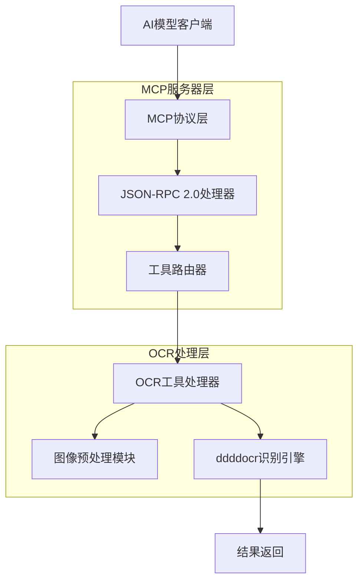
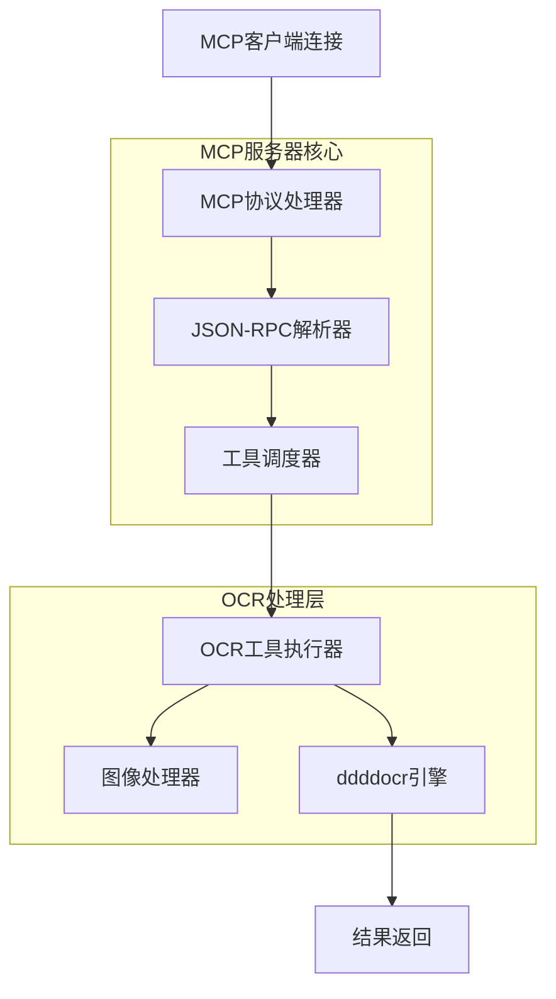

# OCR MCP (Model Context Protocol) 系统技术架构文档

## 1. 轻量级MCP架构设计



## 2. 技术描述

- MCP协议: Model Context Protocol 2024-11-05
- MCP服务器: mcp@1.0.0 + asyncio
- JSON-RPC: 内置JSON-RPC处理
- OCR引擎: ddddocr@1.5.6
- 图像处理: Pillow@10.1.0
- 工具框架: pydantic@2.5.0
- 测试: pytest@7.4.3

## 3. MCP工具定义

| 工具名称 | 工具类型 | 描述 |
|----------|----------|------|
| captcha_recognize | function | 验证码识别工具，接收图像数据并返回识别结果 |
| image_preprocess | function | 图像预处理工具，对图像进行优化和标准化处理 |

## 4. MCP工具接口定义

### 4.1 captcha_recognize工具

**工具描述**: 验证码识别工具，基于ddddocr引擎

**JSON-RPC调用**:
```json
{
  "jsonrpc": "2.0",
  "method": "tools/call",
  "params": {
    "name": "captcha_recognize",
    "arguments": {
      "image_data": "base64_encoded_image",
      "options": {
        "preprocess": true,
        "confidence_threshold": 0.8
      }
    }
  },
  "id": 1
}
```

**输入参数**:
| 参数名称 | 参数类型 | 是否必需 | 描述 |
|----------|----------|----------|------|
| image_data | string | true | Base64编码的图像数据 |
| options.preprocess | boolean | false | 是否进行图像预处理 (默认: true) |
| options.confidence_threshold | float | false | 置信度阈值 (默认: 0.8) |

**响应格式**:
```json
{
  "jsonrpc": "2.0",
  "result": {
    "content": [{
      "type": "text",
      "text": "识别结果: A3B7\n置信度: 0.95"
    }]
  },
  "id": 1
}
```

### 4.2 image_preprocess工具

**工具描述**: 图像预处理工具，优化图像质量

**JSON-RPC调用**:
```json
{
  "jsonrpc": "2.0",
  "method": "tools/call",
  "params": {
    "name": "image_preprocess",
    "arguments": {
      "image_data": "base64_encoded_image",
      "operations": ["denoise", "enhance"]
    }
  },
  "id": 2
}
```

**响应格式**:
```json
{
  "jsonrpc": "2.0",
  "result": {
    "content": [{
      "type": "text",
      "text": "图像预处理完成\n应用操作: 去噪, 增强\n处理后图像已优化"
    }]
  },
  "id": 2
}
```

## 5. 轻量级服务器架构



## 6. 系统特性

### 6.1 轻量级设计

- **无状态架构**: 不保存任何会话或调用记录
- **内存处理**: 所有操作在内存中完成，处理完即释放
- **零配置**: 无需配置文件，启动即可使用
- **隐私保护**: 不存储任何用户数据或图像信息

### 6.2 性能优化

- **快速启动**: 极简依赖，启动时间短
- **低内存占用**: 处理完成后立即释放内存
- **高并发**: 支持多个客户端同时连接
- **错误恢复**: 单次调用失败不影响其他请求