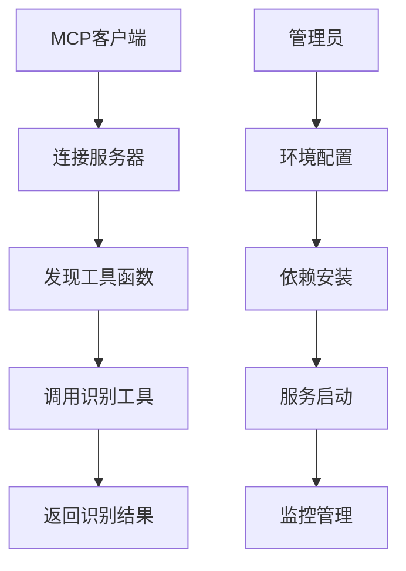

# 基于ddddocr的MCP验证码识别服务器 - 产品需求文档

## 1. 产品概述

本项目是一个基于ddddocr库的MCP（Model Context Protocol）服务器，专门用于提供图形验证码识别功能。
- 该服务器遵循MCP标准协议规范，为大模型提供验证码识别能力，解决自动化流程中的验证码识别问题。
- 目标用户包括需要集成验证码识别功能的开发者、AI应用开发团队以及自动化工具开发者。
- 产品价值在于提供高准确率、低延迟的验证码识别服务，支持多种部署方式，易于集成到现有系统中。

## 2. 核心功能

### 2.1 用户角色

| 角色 | 使用方式 | 核心权限 |
|------|----------|----------|
| MCP客户端 | 通过MCP协议连接 | 可调用验证码识别工具函数，访问资源 |
| 系统管理员 | 直接部署和配置 | 可配置服务器参数，管理资源和日志 |

### 2.2 功能模块

本MCP服务器需求包含以下核心功能模块：
1. **验证码识别服务**：核心OCR识别引擎，工具函数接口，结果返回处理。
2. **MCP协议处理**：协议规范实现，工具函数注册。
3. **传输层配置**：stdio本地通信，SSE远程通信，基础错误处理。

### 2.3 功能详情

| 功能模块 | 子模块 | 功能描述 |
|----------|--------|----------|
| 验证码识别服务 | OCR识别引擎 | 使用ddddocr库实现图形验证码识别，支持多种验证码类型 |
| 验证码识别服务 | 工具函数接口 | 通过@mcp.tool()装饰器暴露识别功能，提供标准化API |
| 验证码识别服务 | 结果处理 | 返回JSON可序列化的识别结果，包含识别文本和置信度 |
| MCP协议处理 | 协议实现 | 严格遵循MCP标准协议规范，确保兼容性 |
| MCP协议处理 | 工具注册 | 自动注册验证码识别工具，提供清晰的文档字符串 |
| 传输层配置 | stdio通信 | 支持本地stdio传输，适合IDE集成场景 |
| 传输层配置 | SSE通信 | 支持HTTP事件流传输，适合Web服务部署 |
| 传输层配置 | 错误处理 | 基础的异常捕获和错误信息返回机制 |

## 3. 核心流程

**MCP客户端使用流程：**
1. 客户端通过stdio或SSE方式连接到MCP服务器
2. 客户端发现可用的验证码识别工具函数
3. 客户端调用识别工具，传入验证码图片数据
4. 服务器使用ddddocr进行识别处理
5. 服务器返回识别结果给客户端

**系统管理员部署流程：**
1. 配置Python 3.10+环境
2. 安装MCP SDK和ddddocr依赖
3. 选择传输方式（stdio或SSE）
4. 启动MCP服务器

## 4. 用户界面设计

### 4.1 设计风格

本项目主要是后端服务，不涉及传统UI界面，但需要考虑以下设计要素：
- 错误信息设计：清晰的错误代码和描述信息
- API响应格式：统一的JSON响应结构
- 文档字符串风格：清晰简洁的函数说明，便于大模型理解

### 4.2 接口设计概览

| 接口类型 | 接口名称 | 设计要素 |
|----------|----------|----------|
| 工具函数 | recognize_captcha | 清晰的参数说明，标准化的返回格式，详细的文档字符串 |
| 错误处理 | 异常响应 | 统一的错误码体系，详细的错误描述 |

### 4.3 响应性

本项目作为服务器端应用，主要考虑以下响应性要求：
- 优化识别算法性能，减少响应延迟
- 支持异步处理模式，避免阻塞其他请求