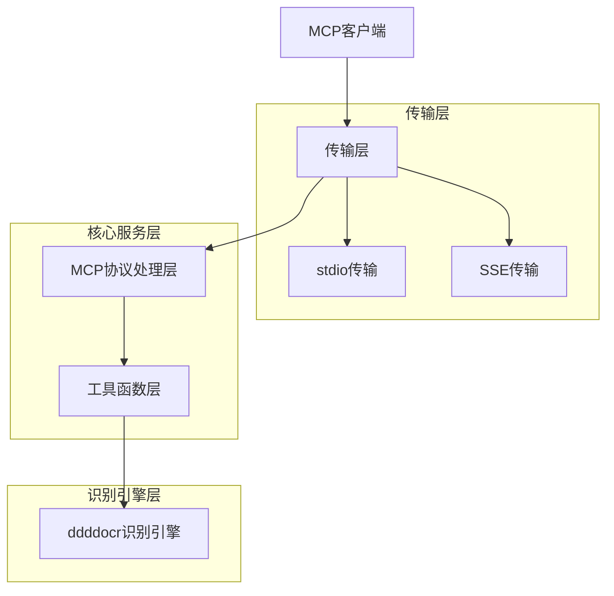
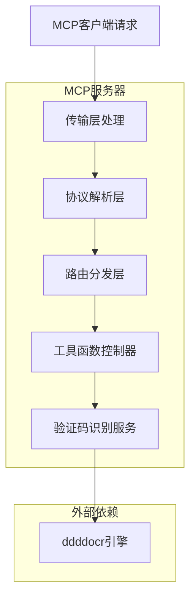
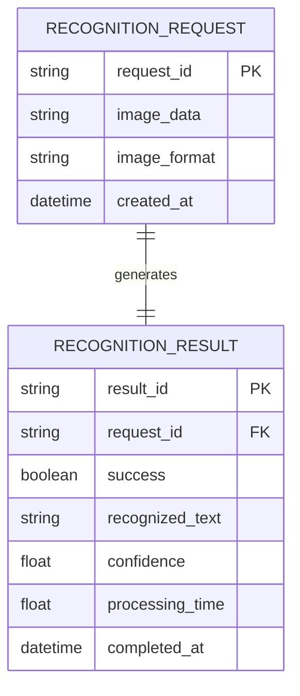

# 基于ddddocr的MCP验证码识别服务器 - 技术架构文档

## 1. 架构设计



## 2. 技术描述

* Frontend: 无（纯后端服务）

* Backend: Python\@3.10+ + mcp\@1.0+ + ddddocr\@1.4+

* 传输协议: MCP (Model Context Protocol)

* 识别引擎: ddddocr

* 依赖管理: pip + requirements.txt

## 3. 路由定义

本项目作为MCP服务器，不使用传统的HTTP路由，而是通过MCP协议定义的工具函数和资源接口：

| 接口类型 | 接口名称               | 用途             |
| ---- | ------------------ | -------------- |
| 工具函数 | recognize\_captcha | 识别验证码图片，返回识别结果 |

## 4. API定义

### 4.1 核心工具函数

**验证码识别工具**

```python
@mcp.tool()
def recognize_captcha(image_data: str, image_format: str = "base64") -> dict
```

请求参数:

| 参数名           | 参数类型   | 是否必需  | 描述                     |
| ------------- | ------ | ----- | ---------------------- |
| image\_data   | string | true  | 验证码图片数据（base64编码或文件路径） |
| image\_format | string | false | 图片数据格式，默认为"base64"     |

响应结果:

| 字段名              | 字段类型    | 描述         |
| ---------------- | ------- | ---------- |
| success          | boolean | 识别是否成功     |
| text             | string  | 识别出的文本内容   |
| confidence       | float   | 识别置信度（0-1） |
| processing\_time | float   | 处理耗时（秒）    |

示例:

```json
{
  "success": true,
  "text": "A3B7",
  "confidence": 0.95,
  "processing_time": 0.12
}
```

## 5. 服务器架构图



## 6. 数据模型

### 6.1 数据模型定义



### 6.2 数据定义语言

由于本项目主要使用内存存储和文件系统，不需要传统的数据库DDL。以下是数据结构定义：

**识别请求数据结构**

```python
# 识别请求模型
class RecognitionRequest:
    def __init__(self):
        self.request_id: str = ""
        self.image_data: str = ""
        self.image_format: str = "base64"
        self.created_at: datetime = datetime.now()

# 识别结果模型
class RecognitionResult:
    def __init__(self):
        self.result_id: str = ""
        self.request_id: str = ""
        self.success: bool = False
        self.recognized_text: str = ""
        self.confidence: float = 0.0
        self.processing_time: float = 0.0
        self.completed_at: datetime = datetime.now()
```

**配置文件结构**

```yaml
# config.yaml
server:
  name: "ddddocr-mcp-server"
  version: "1.0.0"
  transport: "stdio"  # or "sse"
  
recognition:
  engine: "ddddocr"
  max_image_size: 5242880  # 5MB
  supported_formats: ["png", "jpg", "jpeg", "bmp", "gif"]
```

